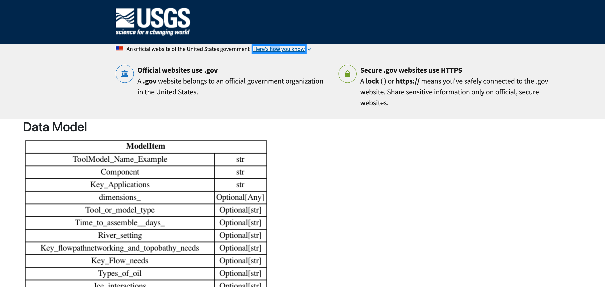
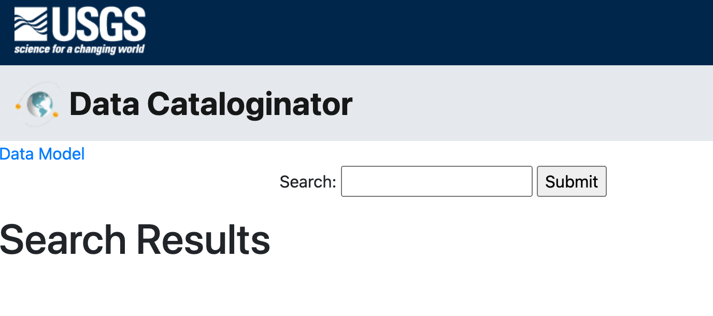
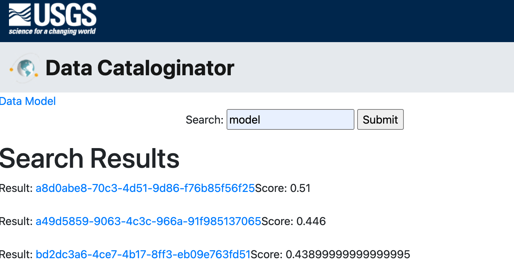
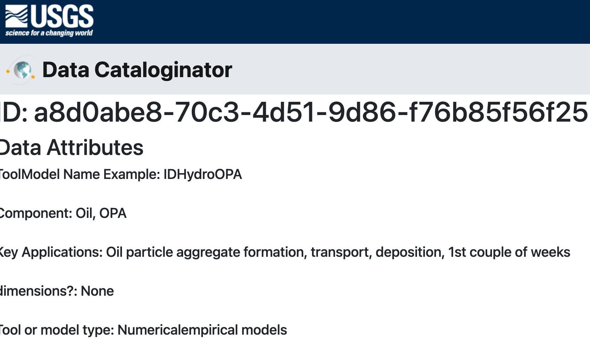
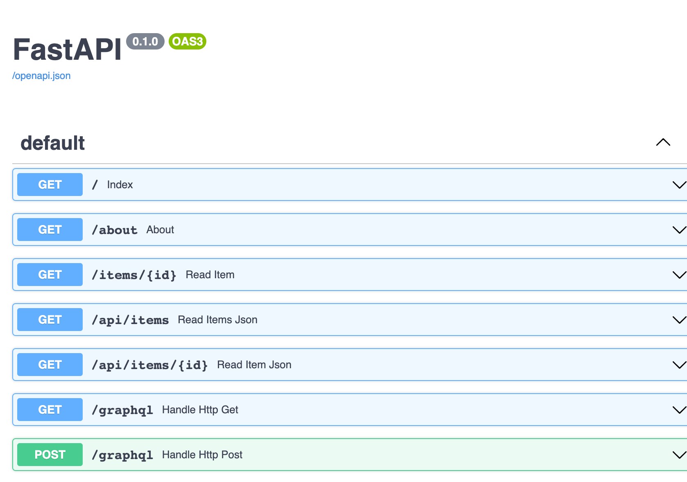

Data catalogs made easy. The Data Cataloginator is written in Python and built using open source projects like FastAPI, Lunr.js, Pydantic, Jinja2 and Bootstrap. The project's goal is to keep everything simple, lightweight, modular and as easy to extend as possible. All data aspects are anchored in JSON from the data model to the search index.

### Features

🔎 **Search** - Lunr.js based search index

💽 **Data** - Pydantic/JSON Schema compatible data model

🤖 **API** - FastAPI based REST API with Swagger UI and GraphQL support paired with GraphiQL

📄 **Website** - Common HTML Jinja2 templating for easy customization

## USGS Software Release Information

(SOFTWARE RELEASE IN PROGRESS)

The official USGS software release can be found at https://doi.org/10.5066/P1336TXZ and cited as follows:

Serna, Brandon and Hsu, Leslie, 2025. Data Cataloginator Version 1.0.0, U.S. Geological Survey software release, https://doi.org/10.5066/P1336TXZ.

IP-174120

A provisional, development version is available at https://github.com/DOI-USGS/data-cataloginator. 

The main branch will have the most up-to-date version of the code.  

## Contacts
- Brandon Serna (bserna@usgs.gov), Lead developer
- Leslie Hsu (lhsu@usgs.gov), Contributor and Outreach


## Getting started

__Requirements__

The [requirements.txt](/requirements.txt) file lists required python packages for running the Data Cataloginator.

__Installation notes__

Pygraphviz is a difficult install. You can try:

```sh
python3 -m pip install \
                --config-settings="--global-option=build_ext" \
                --config-settings="--global-option=-I$(brew --prefix graphviz)/include/" \
                --config-settings="--global-option=-L$(brew --prefix graphviz)/lib/" \
                pygraphviz
```

__Data Cataloginating__

The commands to data cataloginate a .csv of example data into a running, searchable data catalog are all in the Makefile.

However, we have found that some commands do not execute unless you run them on the commandline. We suggest that you run each of the commands in the Makefile individually from the commandline and verify that they executed. 

In practice, if you have a new data file and want to create a new catalog:
```	
rm data/individual_json/*.json
rm app/static/idx.json
rm idx.json
rm *.pyc

python3 scripts/to_json.py

python3 scripts/build_search.py
cp idx.json app/static/idx.json

datamodel-codegen --input data/records.json --input-file-type json --output scripts/data_model.py --output-model-type pydantic_v2.BaseModel

python3 scripts/to_pydantic.py
mv ./data/diagram.png app/static/images/diagram.png
echo "Done ✅"

```

If you just want to run the existing catalog on your local machine, navigate to the app directory and then run uvicorn as follows:

```
cd app
uvicorn main:app --reload
```

Copy and paste the address that appears into your web browser to run the catalog.

## Hosting

A python server is needed for deployment. It's setup with Uvicorn.

## Demo












## License

Unless otherwise noted, This project is in the public domain in the United
States because it contains materials that originally came from the United
States Geological Survey, an agency of the United States Department of
Interior. For more information, see the official USGS copyright policy at
https://www.usgs.gov/information-policies-and-instructions/copyrights-and-credits

Additionally, we waive copyright and related rights in the work
worldwide through the CC0 1.0 Universal public domain dedication.


### CC0 1.0 Universal Summary
-------------------------

This is a human-readable summary of the
[Legal Code (read the full text)][1].


#### No Copyright

The person who associated a work with this deed has dedicated the work to
the public domain by waiving all of his or her rights to the work worldwide
under copyright law, including all related and neighboring rights, to the
extent allowed by law.

You can copy, modify, distribute and perform the work, even for commercial
purposes, all without asking permission.


#### Other Information

In no way are the patent or trademark rights of any person affected by CC0,
nor are the rights that other persons may have in the work or in how the
work is used, such as publicity or privacy rights.

Unless expressly stated otherwise, the person who associated a work with
this deed makes no warranties about the work, and disclaims liability for
all uses of the work, to the fullest extent permitted by applicable law.
When using or citing the work, you should not imply endorsement by the
author or the affirmer.

## Disclaimer

This software is preliminary or provisional and is subject to revision. It is
being provided to meet the need for timely best science. The software has not
received final approval by the U.S. Geological Survey (USGS). No warranty,
expressed or implied, is made by the USGS or the U.S. Government as to the
functionality of the software and related material nor shall the fact of release
constitute any such warranty. The software is provided on the condition that
neither the USGS nor the U.S. Government shall be held liable for any damages
resulting from the authorized or unauthorized use of the software.


[1]: https://creativecommons.org/publicdomain/zero/1.0/legalcode

